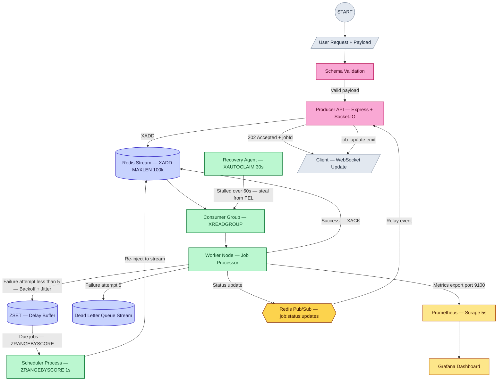
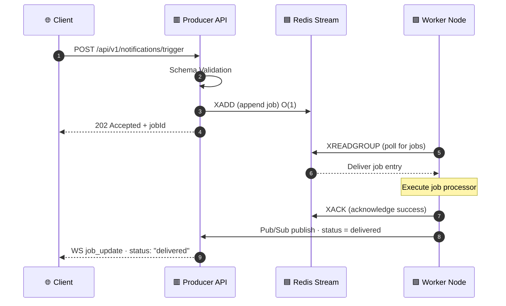
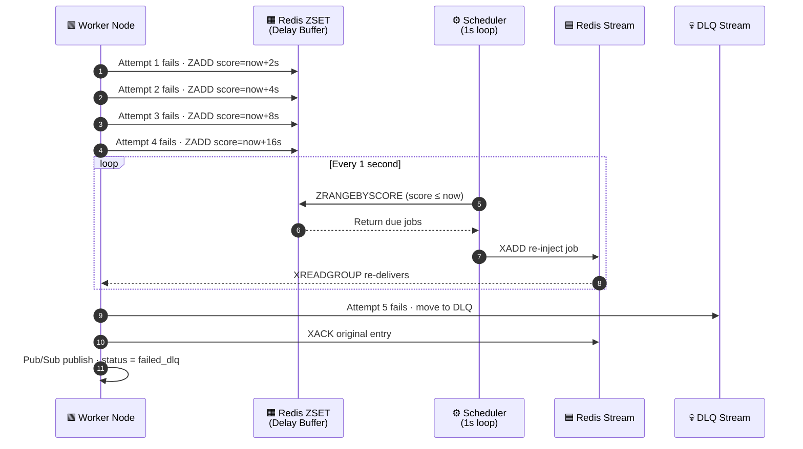
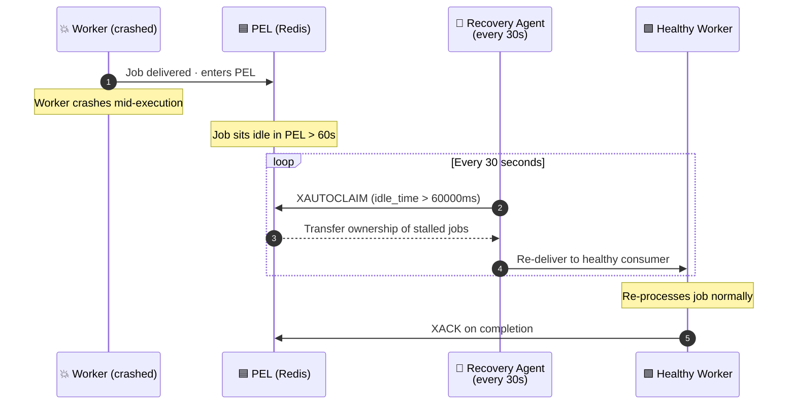
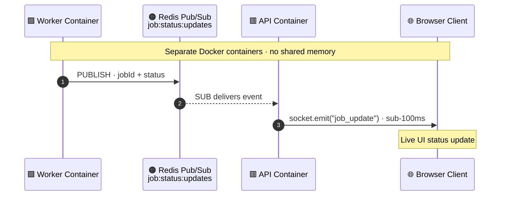
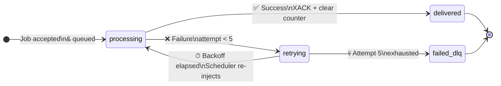

<div align="center">

# VortexMQ

### High-Throughput Event-Driven Notification Engine

*An enterprise-grade, asynchronous, horizontally scalable notification pipeline — built with Node.js ES Modules, Redis Streams, and a full production observability stack.*

</div>

---

## Table of Contents

- [What is VortexMQ?](#-what-is-vortexmq)
- [System Architecture](#-system-architecture)
- [End-to-End Data Lifecycle](#-end-to-end-data-lifecycle)
- [Core Engineering Features](#-core-engineering-features)
- [Project Structure](#-project-structure)
- [API & WebSocket Reference](#-api--websocket-reference)
- [Getting Started](#-getting-started)
- [Testing Guide](#-testing-guide)
- [Observability Stack](#-observability-stack)
- [Technology Stack](#-technology-stack)
- [Glossary](#-glossary)

---

## 🧠 What is VortexMQ?

VortexMQ is a production-grade **Event-Driven Architecture (EDA)** engineered to solve the fundamental bottleneck of synchronous monolithic systems: the blocking request.

When a client submits a notification, VortexMQ **instantly accepts, persists, and acknowledges** it — then processes it entirely out-of-band through a pipeline of decoupled, fault-tolerant background workers. No request ever waits for processing. No downstream failure ever breaks the ingestion path.

The system is built around four strict principles:

| Principle | Implementation |
|---|---|
| **Decoupling** | HTTP ingestion is completely separated from job execution |
| **Durability** | Every job is persisted to Redis Streams before any response is sent |
| **Fault Tolerance** | Crashed workers, transient failures, and retries are all handled automatically |
| **Observability** | Every metric, status change, and queue depth is visible in real time |

---

## 🏗️ System Architecture

VortexMQ is composed of **four independent infrastructure tiers**. Each tier has strictly bounded responsibilities and communicates only through well-defined interfaces.



### Legend

| Color | Tier | Responsibility |
|---|---|---|
| 🩷 Pink | **Tier 1 — Producer API** | HTTP ingestion, schema validation, WebSocket gateway |
| 🟣 Indigo | **Tier 2 — Redis Broker** | Streams, ZSET delay buffer, Dead Letter Queue |
| 🟢 Green | **Tier 3 — Worker Nodes** | Job execution, retry logic, recovery, scheduling |
| 🟡 Yellow | **Tier 4 — Observability** | Prometheus scraping, Grafana dashboards |
| 🟠 Amber | **Pub/Sub Bus** | Cross-container real-time status bridge |

### Tier 1 — Stateless Producer API

A lightweight Express application whose **only responsibility** is ingestion. It validates the incoming payload schema, appends the job to the Redis Stream via `XADD` (O(1) operation), and returns a `202 Accepted` response to the client in under 5ms. It never blocks on processing.

Simultaneously, it runs a Socket.IO server and a Redis Pub/Sub subscriber — listening for worker-emitted status events and relaying them in real time to connected browser clients.

### Tier 2 — Redis Broker Mesh

The system's **central shock absorber**. Redis Streams provide an append-only, time-series log structure that:

- Completely decouples the write path from the execution path
- Guarantees message durability before any `202` is returned
- Coordinates parallel workers via a **Consumer Group** — ensuring each job is delivered to exactly one worker
- Tracks unacknowledged jobs in a **Pending Entries List (PEL)** for at-least-once delivery
- Hosts a **ZSET delay buffer** for scheduled retries with exponential backoff
- Maintains a **Dead Letter Queue (DLQ)** stream for persistently failed jobs

### Tier 3 — Headless Consumer Workers

Independent, containerized background workers that pull jobs via `XREADGROUP`. Each worker:

- Executes the actual processing logic (SMTP simulation, gateway calls, etc.)
- Manages its own retry state and backoff calculations
- Coordinates with sibling workers through the Consumer Group (zero duplicate processing)
- Publishes status updates to the Redis Pub/Sub bus
- Runs a background **Recovery Agent** (`XAUTOCLAIM`) and **Scheduler Process** (`ZRANGEBYSCORE`) as daemon threads

### Tier 4 — Monitoring & Telemetry

A full production observability plane using a **pull model** — zero write overhead on the hot path. The `prom-client` registry inside the worker exposes Counters, Gauges, and Histograms on a scrape endpoint. Prometheus pulls metrics every 5 seconds. Grafana visualizes everything.

---

## 🔄 End-to-End Data Lifecycle

### 1. The Happy Path



---

### 2. The Failure & Retry Path



**Backoff Formula:** `Delay = min(BaseDelay × 2^attempt + rand(Jitter), MaxDelay)`

| Attempt | Approx. Delay | Behavior |
|---------|--------------|----------|
| 1 | ~2s | Parked in ZSET |
| 2 | ~4s | Parked in ZSET |
| 3 | ~8s | Parked in ZSET |
| 4 | ~16s | Parked in ZSET |
| 5 | — | **Moved to DLQ** |

---

### 3. The Crash Recovery Path



---

### 4. The Real-Time WebSocket Bridge



This cross-container bridge is critical. Workers and the Socket.IO server are in **separate Docker containers** with no shared memory. Redis Pub/Sub is the messaging fabric that lets headless workers push sub-100ms status updates directly to browser clients.

---

## ⚙️ Core Engineering Features

### Atomic O(1) Stream Ingestion

```
XADD notifications MAXLEN ~ 100000 * <fields>
```

The `MAXLEN ~ 100000` directive automatically trims the stream to keep memory consumption bounded. The `~` (approximate trimming) is intentional — it uses radix tree node boundaries for near-zero trimming overhead versus exact trimming.

---

### Competing Consumers — Zero Duplication

```
XREADGROUP GROUP vortex-consumers <worker-id>
           COUNT 1 BLOCK 5000
           STREAMS notifications >
```

The `>` special ID means "give me only messages not yet delivered to any other consumer." The Consumer Group acts as a distributed lock — guaranteeing that even with 10 workers polling simultaneously, each job is processed by exactly one worker.

---

### ZSET as a Non-Blocking Delay Queue

Rather than using `setTimeout` (which blocks the Node.js event loop at scale), failed jobs are serialized and inserted into a Redis Sorted Set with their retry timestamp as the score:

```
ZADD retry:queue <epoch_ms_of_retry> <serialized_job_payload>
```

The Scheduler Process runs `ZRANGEBYSCORE retry:queue 0 <now_ms>` every second, atomically retrieves due jobs, and re-injects them into the primary stream — completely non-blocking and container-restart-safe.

---

### Stalled Job Recovery — XAUTOCLAIM

```
XAUTOCLAIM notifications vortex-consumers recovery-agent
           60000              0-0
           COUNT 10
```

This atomic command finds all PEL entries idle for more than 60,000ms, transfers their ownership to the `recovery-agent` consumer, and returns them for re-processing — all in a single round trip.

---

## 📂 Project Structure

```
project2-event-engine/
│
├── api/                                     # ── TIER 1: STATELESS PRODUCER API
│   ├── src/
│   │   ├── controllers/
│   │   │   └── notificationController.js    # Validates schemas, calls service layer
│   │   └── routes/
│   │       └── notificationRoutes.js        # Declares HTTP endpoint route mappings
│   ├── Dockerfile                           # Multi-stage production image builder
│   └── server.js                            # Entrypoint: Express + Socket.IO + Redis Pub/Sub listener
│
├── worker/                                  # ── TIER 3: HEADLESS CONSUMER WORKERS
│   ├── src/
│   │   ├── processors/
│   │   │   └── notificationProcessor.js    # Strategy executors & failure simulation triggers
│   │   └── services/
│   │       ├── consumerEngine.js           # Primary XREADGROUP poll loop, retry logic, metrics hooks
│   │       ├── metricsService.js           # prom-client registry: Counters, Gauges, Histograms
│   │       ├── recoveryService.js          # XAUTOCLAIM daemon — sweeps stalled PEL entries every 30s
│   │       └── schedulerService.js         # ZRANGEBYSCORE loop — re-injects due retry jobs every 1s
│   ├── Dockerfile                           # Alpine multi-stage builder for lean production runners
│   └── index.js                             # Entrypoint: initializes Consumer Group, boots daemon threads
│
├── shared/                                  # ── REUSABLE INTERNAL INFRASTRUCTURE
│   ├── config/
│   │   └── redis.js                         # Redis client manager; enforces zero-offline-queue caps
│   └── package.json                         # Shared module manifest; exposes @engine/shared alias
│
├── monitoring/                              # ── TIER 4: OBSERVABILITY CONFIGS
│   └── prometheus/
│       └── prometheus.yml                   # Scrape target directives at 5s pull intervals
│
├── test-dashboard/                          # ── LOCAL TEST CLIENT
│   └── index.html                           # HTML5/JS client; opens duplex Socket.IO connection
│                                            #   to view live pipeline state updates per jobId
│
├── docker-compose.yml                       # Global multi-container network orchestration mesh
├── package.json                             # Monorepo workspace root; links api, worker, shared
└── .gitignore                               # Excludes node_modules, build artifacts, env files
```

---

## 📡 API & WebSocket Reference

### HTTP Endpoints

#### `POST /api/v1/notifications/trigger`

Ingests a notification event. Validates schema, persists to Redis Stream, and returns immediately.

**Request Body:**
```json
{
  "type": "email",
  "payload": {
    "recipient": "engineer@example.com",
    "body": "System integration milestone achieved."
  }
}
```

**Response — `202 Accepted`:**
```json
{
  "success": true,
  "message": "Notification event accepted and queued successfully.",
  "jobId": "1780574315078-0"
}
```

> The `jobId` is the Redis Stream entry ID — a `<millisecond-timestamp>-<sequence>` string. Use it to subscribe to real-time updates via WebSocket.

---

#### `GET /health`

API liveness probe.

**Response — `200 OK`:**
```json
{
  "status": "UP",
  "service": "Producer API Ingestion Tier"
}
```

---

### Infrastructure Endpoints

| Service | URL |
|---|---|
| Worker Metrics Scrape | `GET http://localhost:9100/metrics` |
| Prometheus | `http://localhost:9090` |
| Grafana | `http://localhost:3000` |

---

### WebSocket Contract — Socket.IO

**Connection:** `ws://localhost:8080`

#### Client → Server

| Event | Payload | Description |
|---|---|---|
| `subscribe_job` | `"<jobId>"` (string) | Joins the real-time status room for a specific job |

#### Server → Client

| Event | Payload | Description |
|---|---|---|
| `job_update` | See below | Broadcasts live status change for the subscribed job |

```json
{
  "jobId": "1780574315078-0",
  "status": "processing",
  "details": {}
}
```

**Status State Machine:**



---

## 🚀 Getting Started

### Prerequisites

| Requirement | Version |
|---|---|
| Node.js | v18+ |
| Docker | Latest stable |
| Docker Compose | v2+ |

---

### Step 1 — Clone the Repository

```bash
git clone <your-repository-url>
cd project2-event-engine
```

---

### Step 2 — Install Monorepo Dependencies

Binds internal workspace symlinks and installs all package trees across `api/`, `worker/`, and `shared/`:

```bash
npm install
```

---

### Step 3 — Launch the Full Cluster

Builds all multi-stage Docker images, provisions the isolated network bridge, and starts every service in dependency order (Redis → Producer API → Worker Nodes → Prometheus → Grafana):

```bash
docker compose up --build
```

> Use `--build` on first run or after any code change. Omit it for faster restarts on unchanged images.

Once running, the following services are live:

| Service | Address |
|---|---|
| Producer API + WebSocket Gateway | `http://localhost:8080` |
| Grafana Dashboard | `http://localhost:3000` |
| Prometheus | `http://localhost:9090` |
| Worker Metrics | `http://localhost:9100/metrics` |

---

## 🧪 Testing Guide

### Test 1 — Happy Path (Single Job)

Dispatch a single well-formed notification and verify end-to-end delivery:

**PowerShell:**
```powershell
Invoke-RestMethod -Uri "http://localhost:8080/api/v1/notifications/trigger" `
  -Method Post `
  -Headers @{"Content-Type" = "application/json"} `
  -Body '{"type": "email", "payload": {"recipient": "dev@example.com", "body": "Happy Path Test"}}'
```

**curl:**
```bash
curl -s -X POST http://localhost:8080/api/v1/notifications/trigger \
  -H "Content-Type: application/json" \
  -d '{"type": "email", "payload": {"recipient": "dev@example.com", "body": "Happy Path Test"}}'
```

**Expected:** Instant `202` response with a `jobId`. Docker logs show `XREADGROUP` delivery → processing → `XACK`.

---

### Test 2 — Competing Consumers (Horizontal Scale)

Scale to 3 worker replicas, then fire 4 rapid jobs:

```bash
docker compose up --scale consumer_worker=3
```

**PowerShell:**
```powershell
for ($i=1; $i -le 4; $i++) {
  Invoke-RestMethod -Uri "http://localhost:8080/api/v1/notifications/trigger" `
    -Method Post `
    -Headers @{"Content-Type" = "application/json"} `
    -Body "{`"type`": `"email`", `"payload`": {`"recipient`": `"user$i@example.com`", `"body`": `"Scale Surge Test`"}}"
}
```

**curl:**
```bash
for i in {1..4}; do
  curl -s -X POST http://localhost:8080/api/v1/notifications/trigger \
    -H "Content-Type: application/json" \
    -d "{\"type\": \"email\", \"payload\": {\"recipient\": \"user$i@example.com\", \"body\": \"Scale Surge Test\"}}"
done
```

**Expected:** Docker logs prefix each row with a different worker ID (`consumer_worker-1`, `consumer_worker-2`, `consumer_worker-3`), confirming zero-duplication load balancing.

---

### Test 3 — Exponential Backoff & DLQ

Trigger the failure simulation path by targeting the `fail@example.com` address:

**PowerShell:**
```powershell
Invoke-RestMethod -Uri "http://localhost:8080/api/v1/notifications/trigger" `
  -Method Post `
  -Headers @{"Content-Type" = "application/json"} `
  -Body '{"type": "email", "payload": {"recipient": "fail@example.com", "body": "Trigger Crash Subsystem"}}'
```

**curl:**
```bash
curl -s -X POST http://localhost:8080/api/v1/notifications/trigger \
  -H "Content-Type: application/json" \
  -d '{"type": "email", "payload": {"recipient": "fail@example.com", "body": "Trigger Crash Subsystem"}}'
```

**Expected:** Watch Docker logs cycle through attempts 1 → 5 with increasing delay durations. After attempt 5, the job is routed to the DLQ stream and a `failed_dlq` WebSocket event is emitted to the client.

---

## 📊 Observability Stack

### Grafana Dashboard

**URL:** `http://localhost:3000` — Credentials: `admin` / `admin`

Pre-wired to the Prometheus data source on first boot. Key panels to monitor:

| Panel | What It Shows |
|---|---|
| **Jobs Processed (total)** | Cumulative counter of successfully delivered jobs |
| **Active Queue Depth** | Current number of unacknowledged PEL entries |
| **DLQ Depth** | Total messages moved to the Dead Letter Queue |
| **Retry Rate** | Rate of jobs entering the backoff ZSET per minute |
| **Processing Latency (p99)** | 99th percentile execution time histogram |

### Prometheus

**URL:** `http://localhost:9090`

Scrapes the worker metrics endpoint every 5 seconds. Use the Graph tab to run PromQL queries directly:

```promql
# Active jobs currently in PEL (unacknowledged)
vortexmq_active_jobs_gauge

# Rate of successfully delivered jobs over last 5 minutes
rate(vortexmq_jobs_processed_total[5m])

# DLQ message accumulation
vortexmq_dlq_total
```

---

## 🧩 Technology Stack

| Layer | Technology | Role |
|---|---|---|
| Runtime | Node.js (ES Modules) | Application runtime |
| API Framework | Express.js | HTTP ingestion layer |
| Message Broker | Redis Streams | Durable job queue + Consumer Groups |
| Retry Queue | Redis Sorted Sets | Non-blocking delay buffer |
| Real-Time Transport | Socket.IO | WebSocket gateway to browser clients |
| Cross-Container Events | Redis Pub/Sub | Worker → API status bridge |
| Metrics Instrumentation | prom-client | Counter / Gauge / Histogram registry |
| Metrics Collection | Prometheus | Pull-model time-series scraper |
| Visualization | Grafana | Live dashboard rendering |
| Containerization | Docker + Compose | Multi-container cluster orchestration |

---

## 📖 Glossary

**Redis Stream** — An append-only log data structure. Each entry receives an auto-generated `<timestamp>-<sequence>` ID. Consumer Groups distribute entries across parallel workers without duplication.

**Consumer Group** — A Redis primitive that acts as a distributed work queue. Multiple consumers share a single stream; each entry is delivered to exactly one consumer.

**PEL (Pending Entries List)** — A per-consumer list of messages that have been delivered but not yet acknowledged with `XACK`. Drives at-least-once delivery guarantees and stalled job detection.

**XAUTOCLAIM** — A Redis command that atomically transfers PEL entries idle longer than a threshold to a new consumer. The mechanism behind crash recovery.

**ZSET (Sorted Set)** — A Redis data structure where each member has a floating-point score. VortexMQ uses epoch timestamps as scores to implement a precise, non-blocking delay queue.

**Dead Letter Queue (DLQ)** — A dedicated Redis Stream for jobs that have exhausted all retry attempts. Isolates poison-pill messages from the main pipeline without data loss, enabling manual inspection and replay.

**Thundering Herd** — A failure pattern where many processes simultaneously retry a downstream service, overwhelming it. Prevented in VortexMQ by the exponential backoff + random jitter formula.

**Competing Consumers Pattern** — Multiple independent workers polling the same queue concurrently. Redis Consumer Groups enforce exclusive delivery, enabling horizontal scaling without race conditions.

---

<div align="center">

*VortexMQ — Built for resilience, engineered for scale.*

</div>